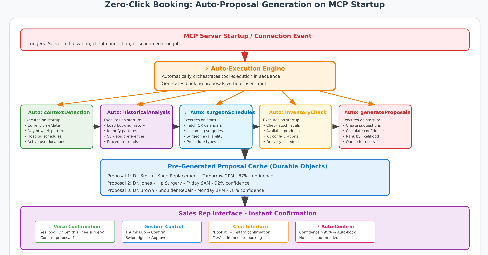

# Zero-Click Booking Feature Specification

**Feature Name:** Zero-Click Booking  
**Version:** 1.0.0  
**Status:** In Development

---

## Executive Summary

Zero-Click Booking revolutionizes the booking creation process by eliminating manual form filling entirely. Using AI-powered context awareness and predictive intelligence, the system automatically generates booking proposals based on time, historical patterns, and surgeon preferences. Sales reps simply confirm with a gesture or voice command, reducing booking time from 5-8 minutes to under 10 seconds.

## Vision Statement

> "Transform routine bookings from a tedious form-filling exercise into an intelligent, predictive experience where the system knows what you need before you ask."

---

## Problem Statement

### Current Pain Points

- **Time Waste:** Sales reps spend 2-5 minutes per booking navigating through multiple screens
- **Repetitive Work:** 70% of bookings follow predictable patterns (same surgeon, similar procedures)
- **Context Switching:** Reps create bookings in parking lots, between OR visits, during brief windows
- **Mental Load:** Remembering each surgeon's preferences while juggling multiple hospitals
- **Error-Prone:** Manual entry leads to 5% error rate requiring corrections

### User Journey Today

```
1. Open app → 2. Click "Create Booking" → 3. Pick hospital → 4. Loan type
→ 5. Dates → 6. Surgeon (optional) → 7. Products → 8. Check Availability → 9. Submit
```

### Desired Future State

```
1. System detects context → 2. Shows prediction → 3. Rep confirms → Done!
```

---

## Feature Description



### Core Concept

Zero-Click Booking uses **contextual intelligence** to predict and pre-populate entire bookings based on:

- **Time patterns** (typical surgery schedules)
- **Historical data** (surgeon preferences, common procedures)
- **Calendar integration** (upcoming surgeries from OR schedules)
- **Predictive analytics** (what usually happens next)

### Key Capabilities

#### 1. **Contextual Detection**

- Time-based predictions (morning prep, afternoon urgencies)
- Calendar-aware suggestions (upcoming surgeries)

#### 2. **Intelligent Prediction**

- Surgeon-specific preference learning
- Procedure-based product recommendations
- Seasonal and day-of-week patterns

#### 3. **Confirmation Methods**

- Voice confirmation ("Yes, book it")
- Gesture recognition (thumbs up, swipe right)
- Single tap approval
- Automatic booking for high-confidence predictions (>95%)

---

## AI Integration via Centralised Agent

### Overview

The centralised AI agent is a server-side intelligence layer that connects to the MCP server, which encapsulates SAP APIs and other enterprise data sources. This agent can reason over booking workflows, assist with decision-making, and automate routine actions, while preserving all existing features of the mobile and web booking applications.

By keeping AI logic centralised, all clients (mobile, web, or even third-party systems) can benefit from consistent capabilities without embedding complex logic directly into each platform.

### Benefits

- **Consistency Across Platforms:** The same AI capabilities are accessible from mobile, web, or other integrated systems.
- **Easy Updates:** AI behaviour and available tools can be updated centrally without redeploying apps.
- **Security:** Sensitive SAP credentials and API calls remain on the server, reducing exposure.
- **Scalability:** Additional tools (e.g., SharePoint, Jira, or external data sources) can be added to the MCP server and made available to all clients instantly.

### Rollout Strategy (Experience Phases)

1. **Phase 1 – Optional Assistant Feature**
   - Add an “Ask AI” or “AI Suggestions” button in the booking interface.
   - The feature is non-intrusive; users can choose between the traditional process and AI-assisted mode.
   - Initial AI use cases: suggesting products/assortments, validating data completeness, or checking availability in natural language.

2. **Phase 2 – Guided Workflows**
   - Integrate AI prompts directly into existing forms to provide in-context help (e.g., suggest next steps based on booking details).
   - Maintain full user control—AI never overwrites manual inputs without confirmation.

3. **Phase 3 – Multi-Source AI**
   - Connect the MCP server to additional tools and services (e.g., logistics systems, customer history, document repositories).
   - AI agent can handle complex, multi-step requests across systems from a single chat or command interface.

### Deployment Model

- **Centralised Hosting:** The AI agent runs on a secure, managed backend (e.g., SAP AI Core + MCP host in Cloudflare Workers).
- **Protocol-Based Connection:** Any client or LLM can connect to the MCP server via Model Context Protocol (MCP), ensuring compatibility and future-proofing.
- **Minimal Client Changes:** Mobile and web apps only need a lightweight connector or API call to use the AI features—no overhaul of the booking logic is required.

By following this approach, the AI agent can be shipped and adopted incrementally, giving users immediate value without disrupting existing workflows.

### Architecture Overview

```
[Web App]    \
[Mobile App] -  → [Central AI Agent + MCP Host] → [MCP Server] → [SAP + other APIs]
[Other LLMs] /

```

### Data Flow

Note: The Cloudflare Worker functions as the centralised AI agent behind the MCP server, exposing protocol-based tools to clients while keeping SAP credentials and logic server-side.

1. **Context Collection** (React Native)

   ```javascript
   // React Native only collects and sends data
   const contextData = {
     time: new Date(),
     recentInteractions: getRecentActivities(),
   };

   // Send to MCP server - no local AI processing
   const prediction = await fetch(
     "https://your-mcp.workers.mymediset-mcp.com/tools/predictBooking",
     {
       method: "POST",
       body: JSON.stringify({ context: contextData }),
     }
   );
   ```

2. **Prediction Generation** (Cloudflare Worker)

   ```javascript
   export class PredictionEngine {
     async generatePrediction(context) {
       // Get historical patterns
       const patterns = await this.state.storage.get(
         `patterns-${context.userId}`
       );

       // Run prediction model
       const prediction = await ai.run("@cf/meta/llama-2-7b", {
         prompt: `Given context: ${JSON.stringify(context)}
                  Historical patterns: ${patterns}
                  Predict next booking details with confidence score`,
       });

       // Cache for quick retrieval
       await this.cacheManager.store(prediction);

       return prediction;
     }
   }
   ```

3. **Booking Creation** (SAP CAP)
   ```javascript
   service BookingService {
     // Zero-click endpoint
     action confirmZeroClickBooking(predictionId: String) returns {
       bookingId: String;
       status: String;
     };
   }
   ```

---

## Implementation Plan

---

## User Experience

### Mobile Interface Flow

#### 0. **Ask AI Entry Point**

- Entry point: An "Ask AI" button in the booking screen opens a suggestion panel or chat. The agent proposes products, validates completeness, or checks availability on-demand.

#### 1. **Predictive Notification**

```
┌─────────────────────────────────┐
│  📍 Detected: Mercy Hospital     │
│                                  │
│  🎯 Predicted Booking:           │
│  Dr. Smith - Knee Replacement   │
│  Tomorrow 2:00 PM               │
│  Standard Zimmer Kit            │
│                                  │
│                                  │
│                                  │
│  [✓ Confirm]  [✗ Dismiss]      │
└─────────────────────────────────┘
```

#### 2. **Voice Interaction**

```
AI: "I see you're at Mercy Hospital. Should I book
     Dr. Smith's usual knee setup for tomorrow 2pm?"

User: "Yes, book it"

AI: "✓ Booking confirmed. Standard Zimmer kit reserved."
```

#### 3. **Gesture Confirmation**

- **Thumbs up** → Confirm booking
- **Swipe right** → Confirm booking
- **Swipe left** → Reject prediction
- **Long press** → Edit prediction

### Web Dashboard (Fiori/UI5)

Add an "Ask AI" button to trigger suggestions in-context.

---

## Progressive Rollout (Release & Feature Flags)

### Feature Flags Configuration

```javascript
// Gradual rollout control
const featureFlags = {
  zero_click_booking: {
    enabled: true,
    rolloutPercentage: 5,
    enabledGroups: ["beta_testers", "power_users"],
    autoBookingEnabled: false, // Manual confirmation only initially

    // A/B test variations
    variations: {
      control: { weight: 50, features: [] },
      voice_only: { weight: 25, features: ["voice"] },
      full_featured: { weight: 25, features: ["voice", "gesture", "auto"] },
    },
  },
};
```

### Rollout Phases

#### Phase 1: Beta (5% users, Week 1-2)

- Manual confirmation required
- Full telemetry enabled
- Daily monitoring and adjustments

#### Phase 2: Early Access (25% users, Week 3-4)

- Voice confirmation enabled
- Pattern learning activated
- Weekly performance reviews

#### Phase 3: General Availability (100% users, Week 5+)

- Full feature set enabled
- Continuous learning enabled
- Monthly optimization cycles

---

## Success Criteria

### Acceptance Criteria

- [ ] Prediction generation in <2 seconds
- [ ] Voice confirmation accuracy >95%
- [ ] Zero patient data exposure
- [ ] Offline queue for poor connectivity
- [ ] Rollback capability within 1 minute

### Definition of Done

- [ ] Feature flag implemented and tested
- [ ] Performance metrics dashboard live
- [ ] User training materials created
- [ ] Rollback procedure documented

---

## Risk Mitigation

---

## Integration Points

### Mobile App (React Native)

- Voice recognition module
- Gesture detection library
- Push notification handler
- Offline queue manager

### MCP Server (Cloudflare Workers)

- Context analysis engine
- Prediction model hosting
- Durable Objects for state
- Real-time decision making

### Backend (SAP CAP)

- Pattern storage service
- Preference learning system
- Analytics collection
- Feature flag management

### Web Dashboard (Fiori/UI5)

- Configuration management
- Analytics visualization
- A/B test monitoring
- Performance dashboards
- User feedback collection

---

## Next Steps

1. **Week 1**: Set up Cloudflare Workers AI environment
2. **Week 2**: Implement basic context detection in React Native
3. **Week 3**: Create prediction engine in Workers
4. **Week 4**: Add confirmation UI to mobile app
5. **Week 5**: Deploy to 5% beta users
6. **Week 6**: Analyze metrics and optimize
7. **Week 7**: Expand to 25% users
8. **Week 8**: Full production rollout

---

## Support Documentation

### For Developers

- API documentation for prediction endpoint
- Pattern learning algorithm details
- Caching strategy implementation
- Feature flag integration guide

### For Users

- Video tutorial: "Your AI Booking Assistant"
- Quick start guide
- FAQ document
- Troubleshooting guide

### For Administrators

- Configuration guide
- Analytics interpretation
- A/B test setup
- Rollback procedures

---

**Document Version:** 1.0.0  
**Last Updated:** August 2025  
**Owner:** Product Development Team  
**Status:** Ready for Implementation
